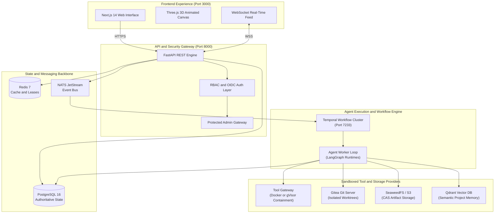
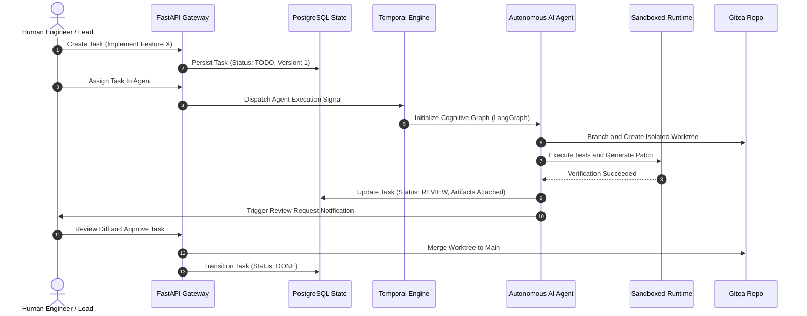

# Agent Space

> **An enterprise operating system for autonomous AI agents and human software engineering teams.**  
> Pair program, orchestrate multi-agent pipelines, enforce zero-trust security boundaries, and collaborate seamlessly in real time.

---

## 1. The Core Idea & Philosophy

Modern AI coding tools are predominantly isolated chatbots, disposable code generators, or fragile single-turn prompt wrappers. They lack **state persistence**, **concurrency control**, **Git isolation**, and **peer parity with human engineers**.

**Agent Space** treats autonomous AI agents as **first-class peers** within an engineering organization:
- **Equal Peer Collaboration**: AI agents can be assigned tasks, raise review requests, push to dedicated Git worktrees, and hand off execution to human engineers with full context preservation.
- **Durable Task Lifecycles**: Workflows are managed by **Temporal**, eliminating fragile long-lived HTTP connections and ensuring tasks survive restarts, network partitions, and pod failures.
- **Strict Concurrency Guarantees**: Multi-tenant database integrity enforced via PostgreSQL row-level locks, optimistic concurrency versioning, and transactional outboxes.
- **Sandboxed Tool Containment**: All code execution, shell commands, and package installations take place inside isolated Docker or gVisor sandbox runtimes with zero-network egress by default.
- **Zero-Trust Identity**: Strictly separated member authentication and a hardened, protected Administrator Portal with zero self-registration options.

---

## 2. System Architecture

### High-Level Component Topology



---

### Human-in-the-Loop Multi-Agent Task Pipeline



---

## 3. Technology Stack & Architectural Decisions

### Layer-by-Layer Tech Stack

| Operational Layer | Technology | Primary Role | Key Configuration |
| :--- | :--- | :--- | :--- |
| **Frontend Framework** | **Next.js 14 (App Router)** | Server & Client Components, Responsive UI | React 18, TypeScript 5.5 |
| **3D Animations** | **Three.js** | Ambient node network & interactive auth core | WebGL, responsive orbital physics |
| **Styling & Design** | **Tailwind CSS + shadcn/ui** | Obsidian dark aesthetic, curved & sharp primitives | Obsidian theme, zero radius dashboard |
| **Backend Framework** | **FastAPI** | High-performance asynchronous REST API | Python 3.11+, Pydantic v2 |
| **Relational Database** | **PostgreSQL 16** | Authoritative single source of truth | AsyncPG, SQLAlchemy 2.0, Alembic |
| **Distributed Cache** | **Redis 7** | Presence, optimistic lease locks, ephemeral cache | Key-value store, Pub/Sub |
| **Event Messaging** | **NATS JetStream** | Real-time domain event streaming | At-least-once delivery, consumer groups |
| **Workflow Engine** | **Temporal** | Durable agent task orchestration & retry handling | Task queues, workflows, signals |
| **Agent Reasoning** | **LangGraph** | Multi-agent stateful cognitive graphs | Cyclical reasoning, tool execution |
| **Tool Sandbox** | **Docker / gVisor** | Untrusted command & code execution containment | Zero egress, CPU/memory limits |
| **Git Management** | **Gitea** | Isolated agent worktrees and branch management | REST API, Webhooks |
| **Artifact Store** | **SeaweedFS / S3** | Content-addressable storage (CAS) for diffs/logs | S3-compatible API |
| **Semantic Memory** | **Qdrant** | High-dimensional vector search over project memory | Cosine similarity embeddings |
| **Identity Provider** | **Keycloak 24 / OIDC** | Enterprise SSO, RBAC roles, JWT signing | OpenID Connect, RS256 JWKS |

---

### Architectural Trade-Off Analysis

| Architectural Decision | Alternative Considered | Why Agent Space Chose This |
| :--- | :--- | :--- |
| **Temporal Workflows** | Celery / RabbitMQ / Cron | Celery cannot handle multi-hour pause/resume states, human-in-the-loop approvals, or survive orchestrator restarts without complex custom state machines. |
| **PostgreSQL 16** | MongoDB / DynamoDB | Strict relational ACID transactions, `SELECT ... FOR UPDATE` row locks, and transactional outboxes prevent race conditions during agent task claims. |
| **Three.js Visuals** | Pure CSS animations | Three.js provides dynamic GPU-accelerated interactive 3D particle nodes that reflect real-time collaboration between human and agent entities. |
| **Isolated Admin Portal** | Shared login with dropdown | Dedicated `/admin/login` strictly rejects non-admin accounts and has zero self-registration options to prevent privilege escalation. |
| **Gitea Worktrees** | Direct commits to main | Prevents concurrent AI agents from stepping on human code; each agent operates on an ephemeral, sandboxed branch. |

---

## 4. Concise Setup Guide (Quickstart)

Follow these 5 steps to get the full stack running locally.

### Step 1: Clone Repository & Check Prerequisites
Ensure you have **Python 3.11+**, **Node.js 20+**, and **Podman** (or Docker) installed:
```bash
git clone https://github.com/ANUJ760/agent-space.git
cd agent-space
```

### Step 2: Configure Environment
Copy the development environment template:
```bash
cp .env.example .env
```
*(For production setups with custom secrets, see [`docs/setup_guide.md`](docs/setup_guide.md)).*

### Step 3: Start Database & Redis
Start PostgreSQL 16 and Redis 7 in rootless containers:
```bash
# Using Podman:
podman run -d --name agentspace-postgres -e POSTGRES_USER=postgres -e POSTGRES_PASSWORD=postgres -e POSTGRES_DB=agentspace -p 5432:5432 postgres:16-alpine
podman run -d --name agentspace-redis -p 6379:6379 redis:7-alpine

# Or using Docker Compose:
# docker compose up -d postgres redis
```

### Step 4: Apply Migrations & Seed Database
Initialize schemas and populate default organizations, RBAC personas, agents, and milestone tasks:
```bash
# Apply schema migrations
PYTHONPATH=apps/backend python3 -m alembic upgrade head

# Run idempotent database seeding
PYTHONPATH=apps/backend python3 scripts/seed_database.py
```

### Step 5: Launch Backend, Collaboration Server & Frontend

**Terminal 1 (Backend API):**
```bash
PYTHONPATH=apps/backend:. python3 -m uvicorn app.main:app --host 0.0.0.0 --port 8000 --reload
```

**Terminal 2 (Live collaboration):**
```bash
npm install
npm run dev --workspace=@agent-space/collab
```

**Terminal 3 (Frontend UI):**
```bash
npm run dev --workspace=@agent-space/frontend
```

Open **[http://localhost:3000](http://localhost:3000)** in your browser.

Each new project gets a Git-backed folder under `WORKSPACE_ROOT` (`./var/workspaces` locally).
Open **Files** from a project to edit together, see collaborators' cursors, run browser agents
against the files, review proposed edits, and create Git checkpoints. Changed workspaces also
receive a checkpoint every five minutes while the backend runs. Push requires a configured
HTTPS repository and a Git token supplied at push time; the token is not stored.

For AWS, mount a persistent EBS volume on a single host (or an EFS access point shared by
the API and collaboration service) at the same `WORKSPACE_ROOT` path. Set `PUBLIC_API_URL`
and `PUBLIC_COLLAB_URL` to externally reachable HTTPS/WSS addresses before building the
frontend. See [workspace architecture](docs/workspace_architecture.md).

---

## 5. Seeded Accounts & Access Matrix

The seeding script provisions the following accounts without preset passwords.
After applying migrations, set a password for each account you want to use:

```bash
PYTHONPATH=apps/backend:. python3 scripts/set_user_password.py admin
PYTHONPATH=apps/backend:. python3 scripts/set_user_password.py lead
```

The command prompts without echoing the password. Existing accounts created
before password hashing also need a password set this way.

### 1. Protected Administrator Portal
- **URL**: [http://localhost:3000/admin/login](http://localhost:3000/admin/login)
- **Direct Protected Endpoint**: `POST /api/v1/auth/admin/login`

| Username | Role | Constraints |
| :--- | :--- | :--- |
| **`admin`** | `ORG_ADMIN` | No signup on admin login. Cannot authenticate via standard `/login` route. |

### 2. Standard Workspace Members
- **URL**: [http://localhost:3000/login](http://localhost:3000/login)
- **Direct Endpoint**: `POST /api/v1/auth/login`

| Username | Role | Permissions |
| :--- | :--- | :--- |
| **`lead`** | `PROJECT_OWNER` | Full project management, task creation, approval gates |
| **`developer`** | `MEMBER` | Claim tasks, pair program with AI agents, review code |
| **`auditor`** | `VIEWER` | Read-only inspection of audit trail and compliance logs |

### 3. Autonomous AI Agents
- **`DevOps-Agent-01`** (`devops-agent-01`): Powered by `claude-3-5-sonnet`, equipped with `ci_cd`, `code_review`, `container_orchestration`, and `security_scanning` capabilities.

---

## 6. Frontend Navigation & Workspace Features

- **Dark Obsidian Aesthetic**: Deep carbon palette (`--background: 240 12% 4%`) with sharp technical cards and slim navigation headers (`h-11`).
- **Curved High-Contrast Auth**: Frosted glassmorphism (`rounded-[32px]`), electric glow highlights, and minimal text.
- **Three.js Interactive Visuals**:
  - `AuthThreeAnimation.tsx`: Rotating 3D holographic collaboration core with interactive mouse physics and dual orbital rings (Cyan for humans, Violet for AI, Amber for Admin).
  - `ThreeTransitionCanvas.tsx`: Ambient route-transition wave acceleration.
- **3-Tab Project Interface**:
  - **Tab 1: Collaborators**: Combined roster of human engineers and active AI agents.
  - **Tab 2: Progress (Middle Tab)**: Visual sprint pipeline with color-coded circular timeline markers:
    - **Cyan Marker (`UserCheck`)**: Human engineer tasks.
    - **Violet Marker (`Bot`)**: Autonomous AI agent tasks.
  - **Tab 3: Deliverables**: Filterable task board by status (`TODO`, `IN_PROGRESS`, `REVIEW`, `DONE`).

---

## 7. Container Build & Docker Support

Build the hardened production container:

```bash
# Build the default production backend image
podman build -t agent-space:backend --target backend .

# Or build the frontend image
podman build -t agent-space:frontend --target frontend .
```

---

## 8. Verification & Test Suites

Agent Space maintains comprehensive test coverage across both backend and frontend:

```bash
# Run full backend test suite (553 passed)
python3 -m pytest

# Run frontend tests (25 passed across 6 suites)
npm run test --workspace=@agent-space/frontend

# Verify TypeScript compilation (0 errors)
npm run type-check --workspace=@agent-space/frontend
```

---

## 9. Comprehensive Documentation Index

For in-depth operational specifications, consult the complete documentation suite:

- [`docs/setup_guide.md`](docs/setup_guide.md) — Comprehensive setup, production environment placeholders, and teardown runbook.
- [`docs/architecture.md`](docs/architecture.md) — System architecture invariants and state machine guarantees.
- [`docs/security.md`](docs/security.md) — Security boundaries, RBAC matrix, and threat modeling.
- [`docs/concurrency.md`](docs/concurrency.md) — Optimistic locking, row-level locks, and idempotency guarantees.
- [`docs/workflows.md`](docs/workflows.md) — Temporal workflow topology and recovery mechanisms.
- [`docs/agents.md`](docs/agents.md) — Multi-agent roles, LangGraph cognitive graphs, and protocols.
- [`docs/deployment.md`](docs/deployment.md) — Kubernetes manifests and OpenTofu infrastructure modules (AWS & Azure).
- [`docs/database.md`](docs/database.md) — PostgreSQL schema specifications and migration policies.

---

## 10. License

This project is licensed under the [Apache 2.0 License](LICENSE).
